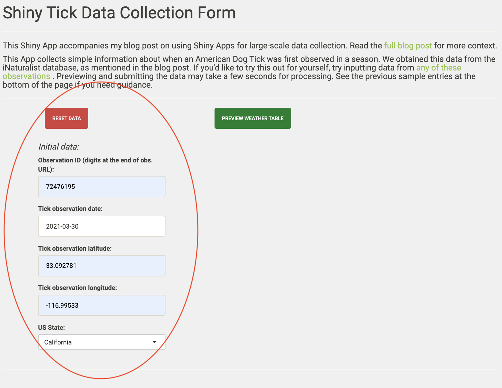
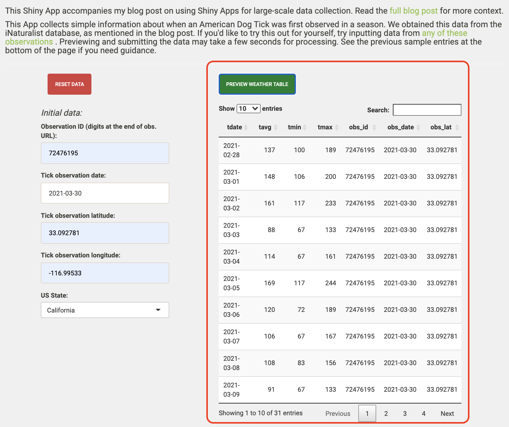

<style type="text/css">

body, td {
   font-size: 18px;
}
code.r{
  font-size: 12px;
}
pre {
  font-size: 11px
}
</style>

<style>
.column-left{
  float: left;
  width: 70%;
  text-align: left;
}
.column-right{
  float: right;
  width: 28%;
  text-align: center;
}
</style>

```{css, echo=FALSE}
pre {
  max-height: 500px;
  overflow-y: auto;
}

pre[class] {
  max-height: 200px;
}
```
<hr>

## Background
I’m deep into the data collection phase of my dissertation. Spreadsheets fly amuck in the cloud. My Evernote is my lifeline to produce some weeks. 

I’ve always struggled inputting data into spreadsheets. I can’t keep track of the column and row headers, and color-coding cells gives me a headache. Collaborating on spreadsheets grows multiplicatively more complicated with each person added to the project. Cross referencing across window panes brings its own problems.

So, I took the plunge to integrate Shiny into my data collection workflows because I wanted to streamline how I collect information across multiple sources. I’d never written a Shiny app before a couple months ago, and the learning curve while self-teaching was steep, but manageable. And Shiny's powerful integration with website APIs, code to tidy and wrangle data, and quick calculations paid off. In this post, I’ll reflect on the advantages of integrating Shiny into data collection workflows that typically involved a plethora of spreadsheet columns, multiple data sources, and online forms connected to spreadsheets. 

Using a heuristic case study, I’ll show the advantages of using interactive Shiny apps to streamline data collection workflows over other spreadsheet and form options. I’ll go through writing a sample Shiny app; much of this code and approach was inspired by Dean Attali’s posts on [Mimicking a Google Form with a Shiny app](https://deanattali.com/2015/06/14/mimicking-google-form-shiny/). Then, I’ll reflect on the experience, the approach's advantages, and some limitations.

**If you want to go straight to the completed app, [click here](https://dbturner.shinyapps.io/shiny_tick/).**

<hr>

_In this post, I will..._

* integrate Shiny, Google Sheets, and NOAA's API to quickly collect data for a hypothetical project about temperature cues for ticks to emerge.

<hr>

## Talking about ticks

I dread spring/early summer for the ticks. Around this time of year, I can’t walk around a field in Michigan without finding a tick when I return home. However, for this exercise, I’m not really sure ticks’ temperature cues to emerge, and I want to know when I have to hole up inside to avoid the ticks. 

I downloaded the tick observations from the [Global Biodiversity Information Facility](https://www.gbif.org/) (GBIF DOI: 10.15436/dl.ezhv96). I searched on 16 April 2021 for the American Dog Tick (Dermacentor variabilis) in the United States recorded in the [iNaturalist database](https://www.inaturalist.org/). I won’t post the data on GitHub, but feel free to try out GBIF and iNaturalist on your own to get the data.

```{r echo = FALSE, message = FALSE, warning = FALSE, tidy.opts=list(width.cutoff=20)}
setwd("~/Downloads") # set to local directory

tick <- read.csv("~/Downloads/tick_data_inaturalist_amended.csv") # load iNaturalist tick data

```

```{r echo = TRUE, message = FALSE, warning = FALSE, tidy.opts=list(width.cutoff=20)}
head(tick)

```

Again, I want to quickly collect the weather (temperature) data for the month before each occurrence. However, let’s say there’s no quick automated way of searching for the temperature at a particular geographic coordinate for a month. We’ll search the dates and coordinates individually. Fortunately, [`rnoaa`](https://docs.ropensci.org/rnoaa/index.html) helps interface with the US National Oceanic and Atmospheric Administration’s (NOAA) weather data so we can do a lot of searching for temperatures and location under the hood. Instead of over 70,000 temperature searches, we only have to search once for the observation date, and the rest will be automatically filled out.

<hr>

## Building the app
We have three files associated with our Shiny Tick app—`global.R`, `server.R`, and `ui.R`. I won’t go into all the details about what these files do, since there are entire books written about writing Shiny apps, like Hadley Wickham’s [Mastering Shiny](https://mastering-shiny.org/) (2021). 

First, we use the following packages:

```{r, eval = FALSE}
library(shiny)
library(shinythemes)
library(shinydashboard)
library(DT)
library(shinyjs)
library(shinyWidgets)
library(rnoaa)
```

<br>

1. In the `global.R` file, we house our Global Environmental variables and functions. Some key ones for this exercise will be:

- defining the fields that will be populated in the Google Sheet connected to our Shiny app:  

```{r echo = TRUE, evaluate = FALSE, warning = FALSE, tidy.opts=list(width.cutoff=20)}
fields <- c("tdate", 
            "tavg", 
            "tmin", 
            "tmax", 
            "obs_id", 
            "obs_date", 
            "obs_lat", 
            "obs_lon", 
            "obs_state", 
            "station_name", 
            "station_id", 
            "distance")
```

- writing functions that save (append) the data produced in Shiny and load the entire Google Sheet upon opening the app or submitting data.

```{r echo = TRUE, evaluate = FALSE, warning = FALSE, tidy.opts=list(width.cutoff=20)}
saveData <- function(data) {
  data <- as.data.frame(data) # Make sure the data object that has all the weather information is a data frame
  
  sheet_append(ssid_shiny_tick, data) # Append all 31 rows to the Google Sheet.
}

loadData <- function() {
  # Read the data
  read_sheet(ssid_shiny_tick)
}
```

<br>

2. In the `server.R` file, we'll define inputs and outputs that will interact with the user. The inputs and outputs are:  

- Inputs for the data about each iNaturalist observation.
```{r echo = TRUE, eval = FALSE, warning = FALSE, tidy.opts=list(width.cutoff=20)}
    output$meta_data <- renderUI({
        fluidRow(
            h4(tags$em("Initial data:")),
            textInput("obs_id", "Observation ID:", ""),
            dateInput("obs_date", "Tick observation date:"),
            textInput("obs_lat", "Tick observation latitude:", ""),
            textInput("obs_lon", "Tick observation longitude:", ""),
            selectInput("obs_state", "US State:", c("",
                                                  "Alabama",
                                                  "Alaska",
                                                  "Arizona",
                                                  "Arkansas",
                                                  "California",
                                                  "Colorado",
                                                  "Connecticut",
                                                  "Delaware",
                                                  "Florida",
                                                  "Georgia",
                                                  "Hawaii",
                                                  "Idaho",
                                                  "Illinois",
                                                  "Indiana",
                                                  "Iowa",
                                                  "Kansas",
                                                  "Kentucky",
                                                  "Louisiana",
                                                  "Maine",
                                                  "Maryland",
                                                  "Massachusetts",
                                                  "Michigan",
                                                  "Minnesota",
                                                  "Mississippi",
                                                  "Missouri",
                                                  "Montana",
                                                  "Nebraska",
                                                  "Nevada",
                                                  "New Hampshire",
                                                  "New Jersey",
                                                  "New Mexico",
                                                  "New York",
                                                  "North Carolina",
                                                  "North Dakota",
                                                  "Ohio",
                                                  "Oklahoma",
                                                  "Oregon",
                                                  "Pennsylvania",
                                                  "Rhode Island",
                                                  "South Carolina",
                                                  "South Dakota",
                                                  "Tennessee",
                                                  "Texas",
                                                  "Utah",
                                                  "Vermont",
                                                  "Virginia",
                                                  "Washington",
                                                  "West Virginia",
                                                  "Wisconsin",
                                                  "Wyoming"))
            
        )
    })
```
  
- A bunch of code under the hood that searches the NOAA data for weather information on the observation date and 30 days before that. See the comments in in the chunk for more information about what the code does.
```{r echo = TRUE, eval = FALSE, warning = FALSE, tidy.opts=list(width.cutoff=20)}
    
    # save the weather data locally when the preview button is hit
    weather_data <- eventReactive(input$preview, { 
        
        obs_lat_lon <- data.frame(id = input$obs_state, 
                                  latitude = input$obs_lat, 
                                  longitude = input$obs_lon) # make a dataframe of the information provided by the user
        
        # search for all nearby NOAA stations within a 100 km radius of the observation location
        nearby_stations <- meteo_nearby_stations(lat_lon_df = obs_lat_lon, 
                                                 radius = 100) 
        # pull out dataframe with the stations from a list
        nearby_stations <- nearby_stations[[1]] 
        
        # for consistency in data reporting, we'll filter the data by those that report at least average temperature, have data until 2021, and are from a reporting station in the United States (not Canada or Mexico)
        nearby_stations_abr <- stations %>%
            semi_join(nearby_stations, by = "id") %>%
            filter(element == "TAVG",
                   last_year == 2021, 
                   grepl("^US", id)) 
        
        # create a dataframe with all the information from both dataframes
        key_stations <- nearby_stations %>%
            semi_join(nearby_stations_abr) 
        
        # get the earliest date to collect data
        obs_date_lag <- (as.Date(input$obs_date) - 30) 
        
        # search the weather data for the nearest station to the observation
        # then combine weather data with data about the station
        # rename some column names
        weather <- meteo_tidy_ghcnd(stationid = key_stations[1,1], 
                                    date_min = obs_date_lag, 
                                    date_max = input$obs_date) %>% 
            left_join(key_stations) %>% 
            rename(station_id = id,
                   tdate = date,
                   station_name = name) 
        
        # redefine the weather dataframe by adding the user inputs to their own columns
        # then tidy the weather dataframe up
        weather <- weather %>%
            mutate(obs_id = rep(input$obs_id, length(weather$tdate)),
                   obs_date = as.character(rep(input$obs_date, length(weather$tdate))),
                   obs_lat = rep(input$obs_lat, length(weather$tdate)),
                   obs_lon = rep(input$obs_lon, length(weather$tdate)),
                   obs_state = rep(input$obs_state, length(weather$tdate)),
                   tdate = as.character(tdate)) %>% 
            select(tdate, tavg, tmin, tmax, obs_id, obs_date, obs_lat, obs_lon, obs_state, station_name, station_id, distance)
        
        as.data.frame(weather)
        
    })
```

- Render the preview table and Google Sheet
```{r echo = TRUE, eval = FALSE, warning = FALSE, tidy.opts=list(width.cutoff=20)}
    output$weather_table <- renderDataTable({
        weather_data()},
        editable = FALSE, rownames= FALSE, options = list(scrollX = TRUE)
    ) # render weather table

    output$responses <- DT::renderDataTable({
        input$submit
        loadData()
    },
    editable = FALSE, rownames= FALSE, options = list(scrollX = TRUE)
    ) # render the Google Sheet table
    
    output$table <- renderUI({
        fluidRow(
            HTML("<div style ='font-size:92%' >"),
            DT::dataTableOutput("responses"),
            HTML("</div>")
        ) 
    }) # format the table from the Google Sheet data    
    
```

- Submit data when `Submit` button pressed
```{r echo = TRUE, eval = FALSE, warning = FALSE, tidy.opts=list(width.cutoff=20)}
    observeEvent(input$submit, {
        saveData(weather_data())
    })
```

- If inputting a new entry in the same session, reset the input boxes by clicking the `Reset` button.
```{r echo = TRUE, eval = FALSE, warning = FALSE, tidy.opts=list(width.cutoff=20)}
    observeEvent(input$reset, {
        reset("obs_id")
        reset("obs_date")
        reset("obs_lat")
        reset("obs_lon")
        reset("obs_state")
    })
```

<br>

3. In the `ui.R` file, we customize the user interface of the inputs and outputs defined in the `server.R` file. See the (`u.R` script) for the code.

<hr>


## The app

After building the app with the three scripts we coded above, we deploy it to our server for our team to collect the data! We'll walk through the app that you can also view [here](https://dbturner.shinyapps.io/shiny_tick/).

<br>
1. When we navigate to the Shiny app URL, we see this screen first.

<center>
{width=65%}
</center>
<br>

2. On the left of the app, we have the five input values for each tick observation. Note: the 'Reset Data' button will reset on these inputs.

<center>
{width=65%}
</center>
<br>


3. After inputting the data, we hit the "Preview Weather Table" button and preview the weather data we'll soon append to the Google Sheet.

<center>
{width=65%}
</center>
<br>

4. After reviewing the preview, we'll submit the data (aka append to the Google Sheet). The Google Sheet will refresh and display the most recent and all previous responses.

<center>
{width=65%}
</center>
<br>

<hr>

## The wrap-up

So what was the point of writing an app that just connects to a spreadsheet to collect data? Why not just input all the information directly into the spreadsheet? Why not just use a preformatted form, like Google Forms?

#### Let's review the _advantages_ of this strategy:  

1. All data are input uniformly, and error on the part of the user is reduced significantly. Unless the user inputs the wrong coordinates, this method standardizes the following items:  
  a. how a weather station is chosen as the closest to the tick observation.  
  b. how the distance between the weather station and the tick observation is measured.  

2. We needed to collect twelve variables for 2,428 tick observations and the temperature for 30 days before those observations (that's **903216** cells in a spreadsheet!).  Rather than manually inserting nearly a million (generously rounding up hahaha) values, we reduce that to just five variables entered into the Shiny app's input boxes for those tick observations. That's a 98.6% reduction in the number of cells that would hypothetically need to be entered by hand if we didn't have this form.  
  
3. Reproducibility is increased with a clear workflow to collect the data. We didn't have to point and click on Google or the NOAA website thousands of times - everything is maintained internally within the app and our downloaded iNaturalist data.  

4. When working with many many columns, the user can get lost in the spreadsheets. Now, the user only has to enter the spreadsheet if they are intentionally editing/correcting missing or misentered values. No more accidental deletes or entries.  

5. While Google Forms and other "pre-made" forms are easier to make than a Shiny app that mimics them, I show here how integrating raw data collection with other information sources, like the NOAA API, can make these online forms that much more powerful.  

#### Let's review a few _drawbacks_:

1. For many people who collect data like those in this case study, Shiny may be unfamiliar, but hopefully posts like this can be a good place to start learning.  

2. Editing within the app is not possible with this approach. You'll have to go back to the primary Google Sheet if you want to fix any issues. That can be a benefit though, if you want to prevent accidental mistakes that arise from directly entering data in the primary Google Sheet.

3. Depending on where you host the Shiny app and how many hours are spent working with it, you may have to pay for additional server time. 

<hr>

If you are spending tons of hours at the computer trying to streamline your data collection workflow, I hope you found this post helpful and you end up a lot happier than I was the day I found this dog tick on me!
<br>

<center>
{width=40%}
</center>

<hr>

Drop a comment as an issue or DM me on Twitter (at)danbtweeter! 

<hr>
##### Post last updated on 7 June 2021


<br>